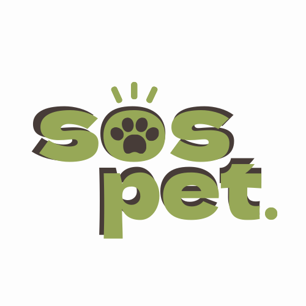

<h1>S.O.S PET</h1>

<h3>Pontifícia Universidade Católica de Minas Gerais</h3> 

`CURSO: Sistemas de Informação`

`DISCIPLINA: Projeto - Aplicações Web`

`SEMESTRE: 1º`

O SOS Pet destaca a importância do reencontro entre animais perdidos e seus donos e o encontro entre bichinhos que precisam de um novo lar, com pessoas em busca de um pet para amar e cuidar.

  
## Integrantes
 

Júlia Persson Mascari

## Orientador
 
Hugo Bastos de Paula

# Planejamento

| Etapa         | Atividades |
|  :----:   | ----------- |
| ETAPA 1         |[Documentação de Contexto](docs/context.md)   [Especificação do Projeto](docs/especification.md) |
| ETAPA 2         |[Projeto de Interface](docs/interface.md)   [Template Padrão](docs/template.md) |
| ETAPA 3         |[Programação de Funcionalidades - HTML e CSS](docs/development.md) |
| ETAPA 4        |[Programação de Funcionalidades - Javascript](docs/development.md)   [Testes de Software ](docs/tests.md) |
| ETAPA 5         | [Apresentação](presentation/README.md) |

# Código

<li><a href="src/README.md"> Código Fonte</a></li>

# Apresentação

<li><a href="presentation/README.md"> Apresentação da solução</a></li>
